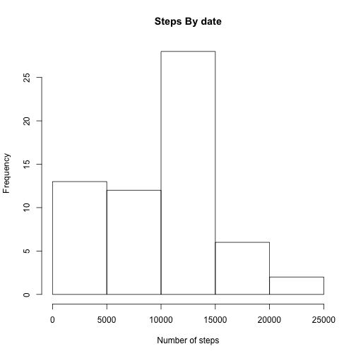
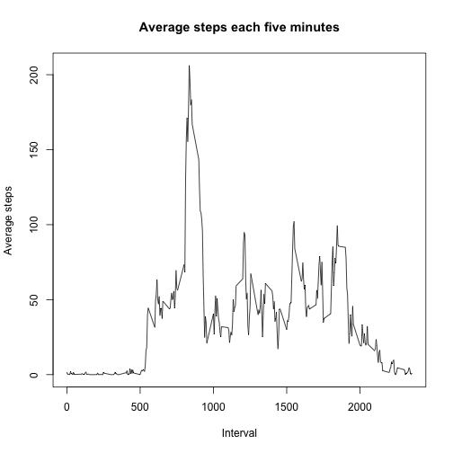
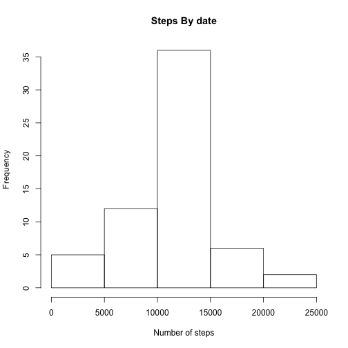
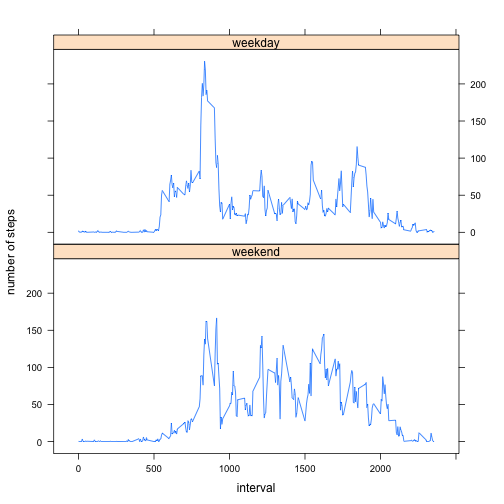

## Loading and preprocessing the data
For reading the data  the function *read.table*  has ben choosen, The parameter *sep* allows us to define the separator as ",", beeing capable of reading the data of the .csv file

```r
activity <- read.table("/Users/nemesis/RCoursera5Assg1/activity.csv",sep=",",header=TRUE,na.strings="NA",colClasses = c("integer","Date","integer"))
```

## What is mean total number of steps taken per day?
As a fist step, we need to get the total numbers of steps grouped by the date. We can achieve this purpose. with the following code:

```r
stepsByDate <- tapply(activity$steps,as.factor(activity$date),function(x) sum(x,na.rm=TRUE))
```
After that the representation of the histogram which take into account the number of occurencies of each of the steps can be plotted:

```r
hist(stepsByDate,xlab="Number of steps",main="Steps By date")
```


Finally we calculate the mean and the median of data

```r
mean(stepsByDate)
```

```
## [1] 9354.23
```

```r
median(stepsByDate)
```

```
## [1] 10395
```
## What is the average daily activity pattern?
###Time series plot of the average number of steps taken
In this case we calculate the average number of steps, but for each interval, through each day. After that, in order to ease the manupulation of the data, we transform from the list of list, result of tapply, to a data frame. Finally we represent the result

```r
AvgSteps <- tapply(activity$steps,as.factor(activity$interval),function(x) mean(x,na.rm=TRUE))
AvgStepsByInterval <- data.frame(intervals=as.integer(names(AvgSteps)), avrgsteps=unname(AvgSteps))
plot( AvgStepsByInterval$intervals,AvgStepsByInterval$avrgsteps,type="l",xlab="Interval",ylab="Average steps", main="Average steps each five minutes")
```




###The 5-minute interval that, on average, contains the maximum number of step
For achieving that me calculte the maximung and the position and interval in which it appears

```r
AvgStepsByInterval [which.max(AvgStepsByInterval$avrgsteps),]
```

```
##     intervals avrgsteps
## 104       835  206.1698
```
## Imputing missing values
####Calculate and report the total number of missing values in the dataset (i.e. the total number of rows with NAs)
The total number of NA can be calculated with the follwing expression. the colum steps is the only one which includes NA

```r
sum(is.na(activity$steps))
```

```
## [1] 2304
```
For the strategy to deal with the NA, a mean for th 5 minutes interval trough all the days will be placed instead of the NA value. For doing taht we redefine the *activity$steps* choosig the mean which was previuously calculated. Because the length of the data doesn't match we have to replicate the vector with the means in order to make of egual length as the original data (we use 61 because is the number of days of the dataset)

```r
activity$steps[ is.na(activity$steps) ] <- rep(AvgStepsByInterval$avrgsteps,61)[ is.na(activity$steps) ] 
```
###Histogram of the total number of steps taken each day after missing values are imputed
We recalculate the means and plot a new historgram

```r
stepsByDate <- tapply(activity$steps,as.factor(activity$date),sum)
hist(stepsByDate,xlab="Number of steps",main="Steps By date")
```


###The new values of the mean and median of the dataset with the new values are:

```r
mean(stepsByDate)
```

```
## [1] 10766.19
```

```r
median(stepsByDate)
```

```
## [1] 10766.19
```
The results are: the histogram looks more like a normal distribution and the mean an median has changed to be equal, so the new distribution is more or less symetrical. The median has less variation, and the mean has increase from 9352,23 to 10776,19. 

## Are there differences in activity patterns between weekdays and weekends?
To know the diferences bettwen weekends and weekdays we define the means for each of the groups and plot them together using the lattice packages. As a first step we add a new column to the activity dataset with the days of the weeks taht belongs to the date, and analyze if the date is weekend or weekday

```r
activity$days <- weekdays(activity$date)
activity$days[ activity$days=="domingo" ] <- "weekend"
activity$days[ activity$days=="sábado" ] <-  "weekend"
activity$days[ activity$days!="weekend" ] <- "weekday"

activityWeekdays <- subset(activity,activity$days=="weekday")
activityWeekends <- subset(activity,activity$days=="weekend")
```
Get the mean for the weekdays:

```r
AvgStepsWeekdays <- tapply(activityWeekdays$steps,as.factor(activityWeekdays$interval),mean)
AvgStepsWeekdaysAsDF <- data.frame(intervals=as.integer(names(AvgStepsWeekdays)), avrgsteps=unname(AvgStepsWeekdays))
AvgStepsWeekdaysAsDF$days <- as.factor("weekday")
```
Get the means for the weekends: 

```r
AvgStepsWeekends <- tapply(activityWeekends$steps,as.factor(activityWeekends$interval),mean)
AvgStepsWeekendsAsDF <- data.frame(intervals=as.integer(names(AvgStepsWeekends)), avrgsteps=unname(AvgStepsWeekends))
AvgStepsWeekendsAsDF$days <- as.factor("weekend")
```

Finally we get the final dataset with the means for the weekends and weekdays as a factor and plot it using the lattige package

```r
TotalAvgSteps <- rbind(AvgStepsWeekendsAsDF,AvgStepsWeekdaysAsDF)
library(lattice)
xyplot(TotalAvgSteps$avrgsteps ~ TotalAvgSteps$interval | TotalAvgSteps$days, type="l", layout=c(1,2), xlab="interval", ylab="number of steps")
```


